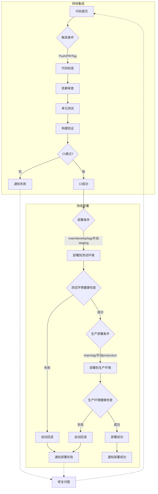

# es6-vue-template

> ES6 Vue 项目模板

## ⛰️ 能力支持

- [`pnpm`](https://github.com/pnpm/pnpm) 使用pnpm包管理工具
- [`Vue Router`](https://github.com/vuejs/router) Vue3 路由
- [`Unocss、Tailwind CSS`](https://github.com/unocss/unocss) 使用unocss原子化css工具、tailwindcssURL_ADDRESS 使用unocss原子化css工具、tailwindcss 配合使用，减少CSS体积
- [`Pinia`](https://pinia.vuejs.org) - 直接的, 类型安全的, 使用 Composition API 的轻便灵活的 Vue 状态管理
- [`vite-plugin-vue-markdown`](https://github.com/antfu/vite-plugin-vue-markdown) - Markdown 作为组件，也可以让组件在 Markdown 中使用
- [`markdown-it-prism`](https://github.com/jGleitz/markdown-it-prism) - [Prism](https://prismjs.com/) 的语法高亮
- [`prism-theme-vars`](https://github.com/antfu/prism-theme-vars) - 利用 CSS 变量自定义 Prism.js 的主题
- [`Vue I18n`](https://github.com/intlify/vue-i18n-next) - 国际化
- [`VueUse`](https://github.com/antfu/vueuse) - 实用的 Composition API 工具合集
- [`@vueuse/head`](https://github.com/vueuse/head) - 响应式地操作文档头信息
- [`vite-plugin-vue-devtools`](https://github.com/webfansplz/vite-plugin-vue-devtools) - 旨在增强 Vue 开发者体验的 Vite 插件
- 使用 Composition API 地 [`<script setup>` SFC 语法](https://github.com/vuejs/rfcs/pull/227)
- [`TypeScript`](https://www.typescriptlang.org/)
- [`Vitest`](https://github.com/vitest-dev/vitest) - 基于 Vite 的单元测试框架
- [`zfleaves-monitor-web`](https://www.npmjs.com/package/zfleaves-monitor-web) - 自定义前端vue监控插件
- [`zfleaves-monitor-web-performance`](https://www.npmjs.com/package/zfleaves-monitor-web-performance) - 自定义前端web性能监控,用于监控FCP\FP\CLS\LCP\CCP\FID\FPS 等性能指标。

## 🛡️ 配置要求

- [node](https://nodejs.org/en) >=14.18

## 🔨 如何使用

1.下载代码仓库，执行如下指令

```sh
git clone https://github.com/zfleaves/vue-pc-template.git
cd vue-pc-template
```

2.安装依赖

> 前提条件：使用最新版本的 pnpm

```sh
pnpm run init # pnpm install
```

3.执行指令

开发
只需要执行以下命令就可以在 `http://localhost:5000` 中看到

```sh
pnpm dev
```

构建

```sh
pnpm build
```

然后会看到用于发布的 dist 文件夹被生成。

## 🚀 CI/CD

本项目使用 GitHub Actions 实现自动化的持续集成和持续部署流程。

### 持续集成 (CI)

持续集成部分确保代码质量和功能正确性，包括以下步骤：

1. **代码检查**：
   - ESLint 进行代码风格和质量检查
   - TypeScript 类型检查
   - Prettier 代码格式化验证

2. **单元测试**：
   - 使用 Vitest 运行单元测试
   - 生成测试覆盖率报告
   - 验证组件快照是否匹配

3. **构建验证**：
   - 验证项目是否能够成功构建
   - 检查构建产物的完整性
   - 分析构建性能和体积

4. **依赖审查**：
   - 自动检查依赖包的安全漏洞
   - 验证许可证合规性
   - 检查过时的依赖包

每次代码提交或 PR 创建时，CI 流程会自动运行，确保代码变更不会引入问题。

### 触发条件

- **Push 触发**：
  - 主分支：`main`、`develop`
  - 功能分支：所有 `feature/*` 分支
  - 版本标签：所有 `v*` 标签（如 v1.0.0）
- **Pull Request**：
  - 目标分支：`main`、`develop`
  - 事件类型：opened、synchronize、reopened
- **手动触发**：支持手动选择部署环境（staging/production）
- **定时触发**：每天 UTC 0:00（北京时间 8:00）执行

### 部署流程

1. **测试环境部署** 触发条件：
   - 推送到 `main` 或 `develop` 分支
   - 手动触发并选择 `staging` 环境
   - 推送版本标签

2. **生产环境部署** 触发条件：
   - 推送到 `main` 分支
   - 手动触发并选择 `production` 环境
   - 推送版本标签

### 部署安全措施

- **版本控制**：
  - 自动备份当前版本
  - 保留最近 5 个版本用于快速回滚
  
- **健康检查**：
  - 部署后自动进行应用健康检查
  - 检查失败自动回滚到上一版本
  
- **通知机制**：
  - 部署成功/失败通过 Slack 通知
  - 包含部署分支、提交信息和触发者等详细信息

### 手动触发部署

1. 进入项目的 GitHub 页面
2. 切换到 "Actions" 标签页
3. 选择 "CI/CD Pipeline" 工作流
4. 点击 "Run workflow"
5. 选择目标环境（staging/production）
6. 确认启动工作流

### 部署状态监控

- GitHub Actions 页面实时展示部署状态
- Slack 频道接收部署通知
- 部署日志保留供后续分析

### CI/CD 工作流程图



### CI 质量门禁

为确保代码质量，我们设置了以下质量门禁：

1. **代码质量指标**：
   - 测试覆盖率 ≥ 80%
   - 重复代码率 < 3%
   - 代码异味 = 0
   - TypeScript 严格模式检查通过

2. **性能指标**：
   - 构建产物体积增量 < 10%
   - 首屏加载时间 < 2s
   - Core Web Vitals 指标达标

3. **安全指标**：
   - 零严重或高危安全漏洞
   - 依赖包许可证合规
   - 敏感信息泄露检查

4. **提交规范**：
   - 提交信息符合 Conventional Commits 规范
   - 分支命名规范检查
   - 必要的文档更新

只有通过所有质量门禁的代码才能进入部署阶段。

### 配置 CI/CD 所需的密钥

在 GitHub 仓库的 Settings > Secrets 中配置以下密钥：

```
# SSH 相关配置
SERVER_SSH_KEY          - 服务器的 SSH 私钥
KNOWN_HOSTS            - 服务器的 known_hosts 内容

# 测试环境配置
STAGING_SERVER_IP      - 测试服务器 IP 地址
STAGING_SERVER_USER    - 测试服务器用户名
STAGING_DEPLOY_PATH    - 测试环境部署路径
STAGING_HEALTH_CHECK_URL - 测试环境健康检查 URL

# 生产环境配置
PRODUCTION_SERVER_IP   - 生产服务器 IP 地址
PRODUCTION_SERVER_USER - 生产服务器用户名
PRODUCTION_DEPLOY_PATH - 生产环境部署路径
PRODUCTION_HEALTH_CHECK_URL - 生产环境健康检查 URL

# Slack 通知配置
SLACK_BOT_TOKEN        - Slack Bot 令牌
SLACK_CHANNEL_ID       - Slack 频道 ID
```
