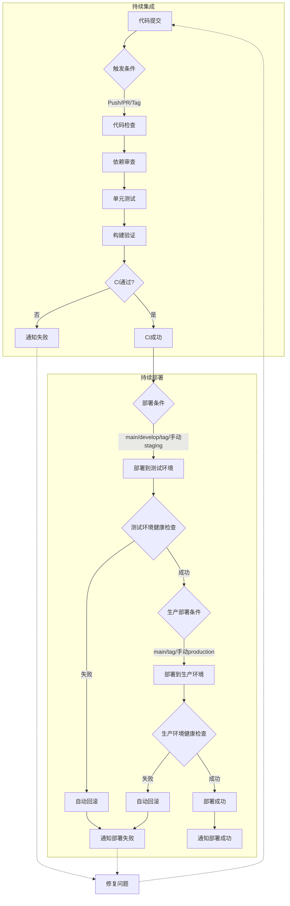
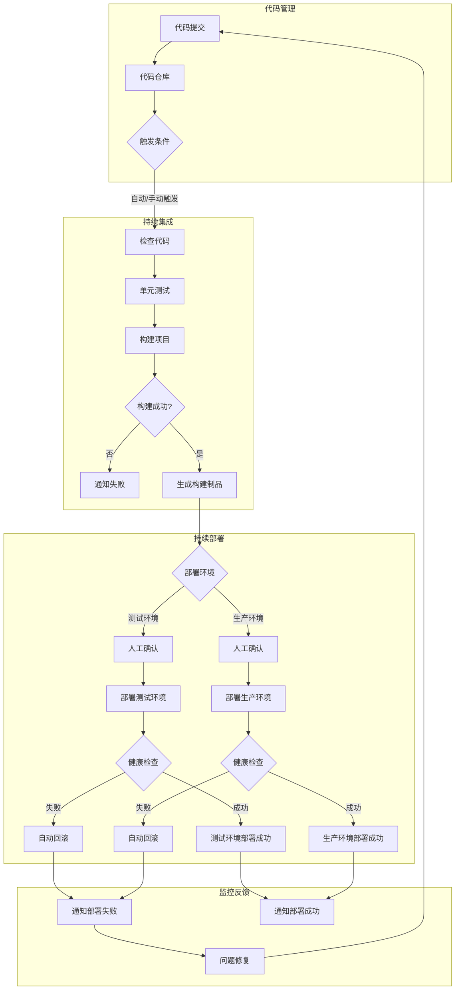

# es6-vue-template

> ES6 Vue 项目模板

## ⛰️ 能力支持

- [`pnpm`](https://github.com/pnpm/pnpm) 使用pnpm包管理工具
- [`Vue Router`](https://github.com/vuejs/router) Vue3 路由
- [`Unocss、Tailwind CSS`](https://github.com/unocss/unocss) 使用unocss原子化css工具、tailwindcssURL_ADDRESS 使用unocss原子化css工具、tailwindcss 配合使用，减少CSS体积
- [`Pinia`](https://pinia.vuejs.org) - 直接的, 类型安全的, 使用 Composition API 的轻便灵活的 Vue 状态管理
- [`vite-plugin-vue-markdown`](https://github.com/antfu/vite-plugin-vue-markdown) - Markdown 作为组件，也可以让组件在 Markdown 中使用
- [`markdown-it-prism`](https://github.com/jGleitz/markdown-it-prism) - [Prism](https://prismjs.com/) 的语法高亮
- [`prism-theme-vars`](https://github.com/antfu/prism-theme-vars) - 利用 CSS 变量自定义 Prism.js 的主题
- [`Vue I18n`](https://github.com/intlify/vue-i18n-next) - 国际化
- [`VueUse`](https://github.com/antfu/vueuse) - 实用的 Composition API 工具合集
- [`@vueuse/head`](https://github.com/vueuse/head) - 响应式地操作文档头信息
- [`vite-plugin-vue-devtools`](https://github.com/webfansplz/vite-plugin-vue-devtools) - 旨在增强 Vue 开发者体验的 Vite 插件
- 使用 Composition API 地 [`<script setup>` SFC 语法](https://github.com/vuejs/rfcs/pull/227)
- [`TypeScript`](https://www.typescriptlang.org/)
- [`Vitest`](https://github.com/vitest-dev/vitest) - 基于 Vite 的单元测试框架
- [`zfleaves-monitor-web`](https://www.npmjs.com/package/zfleaves-monitor-web) - 自定义前端vue监控插件
- [`zfleaves-monitor-web-performance`](https://www.npmjs.com/package/zfleaves-monitor-web-performance) - 自定义前端web性能监控,用于监控FCP\FP\CLS\LCP\CCP\FID\FPS 等性能指标。

## 🛡️ 配置要求

- [node](https://nodejs.org/en) >=14.18

## 🔨 如何使用

1.下载代码仓库，执行如下指令

```sh
git clone https://github.com/zfleaves/vue-pc-template.git
cd vue-pc-template
```

2.安装依赖

> 前提条件：使用最新版本的 pnpm

```sh
pnpm run init # pnpm install
```

3.执行指令

开发
只需要执行以下命令就可以在 `http://localhost:5000` 中看到

```sh
pnpm dev
```

构建

```sh
pnpm build
```

然后会看到用于发布的 dist 文件夹被生成。

## 🚀 CI/CD

本项目使用 GitHub Actions 实现自动化的持续集成和持续部署流程。

### 持续集成 (CI)

持续集成部分确保代码质量和功能正确性，包括以下步骤：

1. **代码检查**：
   - ESLint 进行代码风格和质量检查
   - TypeScript 类型检查
   - Prettier 代码格式化验证

2. **单元测试**：
   - 使用 Vitest 运行单元测试
   - 生成测试覆盖率报告
   - 验证组件快照是否匹配

3. **构建验证**：
   - 验证项目是否能够成功构建
   - 检查构建产物的完整性
   - 分析构建性能和体积

4. **依赖审查**：
   - 自动检查依赖包的安全漏洞
   - 验证许可证合规性
   - 检查过时的依赖包

每次代码提交或 PR 创建时，CI 流程会自动运行，确保代码变更不会引入问题。

### 触发条件

- **Push 触发**：
  - 主分支：`main`、`develop`
  - 功能分支：所有 `feature/*` 分支
  - 版本标签：所有 `v*` 标签（如 v1.0.0）
- **Pull Request**：
  - 目标分支：`main`、`develop`
  - 事件类型：opened、synchronize、reopened
- **手动触发**：支持手动选择部署环境（staging/production）
- **定时触发**：每天 UTC 0:00（北京时间 8:00）执行

### 部署流程

1. **测试环境部署** 触发条件：
   - 推送到 `main` 或 `develop` 分支
   - 手动触发并选择 `staging` 环境
   - 推送版本标签

2. **生产环境部署** 触发条件：
   - 推送到 `main` 分支
   - 手动触发并选择 `production` 环境
   - 推送版本标签

### 部署安全措施

- **版本控制**：
  - 自动备份当前版本
  - 保留最近 5 个版本用于快速回滚
  
- **健康检查**：
  - 部署后自动进行应用健康检查
  - 检查失败自动回滚到上一版本
  
- **通知机制**：
  - 部署成功/失败通过 Slack 通知
  - 包含部署分支、提交信息和触发者等详细信息

### 手动触发部署

1. 进入项目的 GitHub 页面
2. 切换到 "Actions" 标签页
3. 选择 "CI/CD Pipeline" 工作流
4. 点击 "Run workflow"
5. 选择目标环境（staging/production）
6. 确认启动工作流

### 部署状态监控

- GitHub Actions 页面实时展示部署状态
- Slack 频道接收部署通知
- 部署日志保留供后续分析

### CI/CD 工作流程图



### CI 质量门禁

为确保代码质量，我们设置了以下质量门禁：

1. **代码质量指标**：
   - 测试覆盖率 ≥ 80%
   - 重复代码率 < 3%
   - 代码异味 = 0
   - TypeScript 严格模式检查通过

2. **性能指标**：
   - 构建产物体积增量 < 10%
   - 首屏加载时间 < 2s
   - Core Web Vitals 指标达标

3. **安全指标**：
   - 零严重或高危安全漏洞
   - 依赖包许可证合规
   - 敏感信息泄露检查

4. **提交规范**：
   - 提交信息符合 Conventional Commits 规范
   - 分支命名规范检查
   - 必要的文档更新

只有通过所有质量门禁的代码才能进入部署阶段。

### 配置 CI/CD 所需的密钥

在 GitHub 仓库的 Settings > Secrets 中配置以下密钥：

```
# SSH 相关配置
SERVER_SSH_KEY          - 服务器的 SSH 私钥
KNOWN_HOSTS            - 服务器的 known_hosts 内容

# 测试环境配置
STAGING_SERVER_IP      - 测试服务器 IP 地址
STAGING_SERVER_USER    - 测试服务器用户名
STAGING_DEPLOY_PATH    - 测试环境部署路径
STAGING_HEALTH_CHECK_URL - 测试环境健康检查 URL

# 生产环境配置
PRODUCTION_SERVER_IP   - 生产服务器 IP 地址
PRODUCTION_SERVER_USER - 生产服务器用户名
PRODUCTION_DEPLOY_PATH - 生产环境部署路径
PRODUCTION_HEALTH_CHECK_URL - 生产环境健康检查 URL

# Slack 通知配置
SLACK_BOT_TOKEN        - Slack Bot 令牌
SLACK_CHANNEL_ID       - Slack 频道 ID
```

## 🚀 使用 Coding 实现 CI/CD

除了 GitHub Actions，本项目也支持使用 Coding 进行持续集成和部署。Coding 是国内领先的 DevOps 平台，提供代码托管、项目管理、测试管理、持续集成/部署等一站式研发工具。

### Coding CI/CD 配置步骤

1. **创建构建计划**：
   - 登录 Coding，进入您的项目
   - 点击"持续集成" > "构建计划" > "创建构建计划"
   - 选择"自定义构建过程"

2. **配置构建环境**：
   - 选择构建环境：Node.js 环境（推荐 Node 16+）
   - 代码源：选择您的代码仓库和分支

3. **配置构建过程**：

```yaml
# .coding-ci.yml 文件示例
version: 2.0
stages:
  - 检查
  - 测试
  - 构建
  - 部署测试环境
  - 部署生产环境

检查代码:
  stage: 检查
  node_version: 16
  commands:
    - pnpm install
    - pnpm run lint
    - pnpm run type-check

单元测试:
  stage: 测试
  node_version: 16
  commands:
    - pnpm install
    - pnpm run test:unit
  artifacts:
    reports:
      junit: ./test-results.xml
      cobertura: ./coverage/cobertura-coverage.xml

构建项目:
  stage: 构建
  node_version: 16
  commands:
    - pnpm install
    - pnpm run build
  artifacts:
    paths:
      - dist/

部署测试环境:
  stage: 部署测试环境
  when: manual
  node_version: 16
  commands:
    - mkdir -p ~/.ssh
    - echo "$CODING_DEPLOY_KEY" > ~/.ssh/id_rsa
    - chmod 600 ~/.ssh/id_rsa
    - ssh-keyscan -t rsa $STAGING_SERVER >> ~/.ssh/known_hosts
    - tar -czf dist.tar.gz dist
    - scp dist.tar.gz $STAGING_USER@$STAGING_SERVER:$STAGING_PATH
    - ssh $STAGING_USER@$STAGING_SERVER "cd $STAGING_PATH && mkdir -p backups && if [ -d 'current' ]; then mv current backups/backup_$(date +%Y%m%d_%H%M%S); fi && mkdir -p current && tar -xzf dist.tar.gz -C current && rm dist.tar.gz && ls -t backups | tail -n +6 | xargs -I {} rm -rf backups/{}"
    - curl -f $STAGING_HEALTH_CHECK_URL || (echo "健康检查失败，正在回滚..." && ssh $STAGING_USER@$STAGING_SERVER "cd $STAGING_PATH && rm -rf current && mv backups/$(ls -t backups | head -1) current" && exit 1)

部署生产环境:
  stage: 部署生产环境
  when: manual
  only:
    - main
    - /^v\d+\.\d+\.\d+$/
  node_version: 16
  commands:
    - mkdir -p ~/.ssh
    - echo "$CODING_DEPLOY_KEY" > ~/.ssh/id_rsa
    - chmod 600 ~/.ssh/id_rsa
    - ssh-keyscan -t rsa $PRODUCTION_SERVER >> ~/.ssh/known_hosts
    - tar -czf dist.tar.gz dist
    - scp dist.tar.gz $PRODUCTION_USER@$PRODUCTION_SERVER:$PRODUCTION_PATH
    - ssh $PRODUCTION_USER@$PRODUCTION_SERVER "cd $PRODUCTION_PATH && mkdir -p backups && if [ -d 'current' ]; then mv current backups/backup_$(date +%Y%m%d_%H%M%S); fi && mkdir -p current && tar -xzf dist.tar.gz -C current && rm dist.tar.gz && ls -t backups | tail -n +6 | xargs -I {} rm -rf backups/{}"
    - curl -f $PRODUCTION_HEALTH_CHECK_URL || (echo "健康检查失败，正在回滚..." && ssh $PRODUCTION_USER@$PRODUCTION_SERVER "cd $PRODUCTION_PATH && rm -rf current && mv backups/$(ls -t backups | head -1) current" && exit 1)
```

4. **配置环境变量**：
   在 Coding 项目设置中添加以下环境变量：

```
# 部署密钥
CODING_DEPLOY_KEY      - 用于部署的 SSH 私钥

# 测试环境配置
STAGING_SERVER         - 测试服务器地址
STAGING_USER           - 测试服务器用户名
STAGING_PATH           - 测试环境部署路径
STAGING_HEALTH_CHECK_URL - 测试环境健康检查 URL

# 生产环境配置
PRODUCTION_SERVER      - 生产服务器地址
PRODUCTION_USER        - 生产服务器用户名
PRODUCTION_PATH        - 生产环境部署路径
PRODUCTION_HEALTH_CHECK_URL - 生产环境健康检查 URL
```

5. **触发构建**：
   - 自动触发：推送代码到指定分支
   - 手动触发：在 Coding 控制台手动启动构建
   - 定时触发：设置定时构建计划

### Coding CI/CD 特性

- **构建缓存**：启用依赖缓存加速构建
- **并行构建**：支持多任务并行执行
- **构建矩阵**：支持多环境测试
- **自定义工作流**：可视化编排流水线
- **制品管理**：自动归档构建产物
- **质量报告**：集成测试、覆盖率报告
- **通知集成**：支持企业微信、钉钉等通知
- **审批流程**：支持人工审批部署
- **蓝绿部署**：支持高级部署策略

### Coding 与 GitHub Actions 的区别

- Coding 提供更完善的中文支持和本地化服务
- Coding 支持与腾讯云、阿里云等国内云服务更好的集成
- Coding 提供更完整的 DevOps 全流程工具链
- Coding 在国内网络环境下访问更快
- Coding 支持私有化部署版本

### Coding CI/CD 工作流程图



### 在项目中添加 Coding CI/CD 配置

1. 在项目根目录创建 `.coding-ci.yml` 文件
2. 复制上述配置示例并根据项目需求调整
3. 提交到代码仓库
4. 在 Coding 平台创建并配置构建计划

通过以上步骤，您可以在 Coding 平台上实现与 GitHub Actions 类似的 CI/CD 流程，享受国内更快的构建速度和更本地化的服务支持。

## 🌩️ Coding 部署到腾讯云

Coding 与腾讯云有深度集成，可以便捷地将项目部署到腾讯云服务。

### 部署到腾讯云 COS

适合静态网站托管：

```yaml
部署到腾讯云COS:
  stage: 部署
  node_version: 16
  commands:
    - pnpm install -g coscmd
    - coscmd config -a $COS_SECRET_ID -s $COS_SECRET_KEY -b $COS_BUCKET -r $COS_REGION
    - coscmd upload -r ./dist/ /
    - coscmd cdnurl $COS_CDN_URL purge -d
```

### 部署到腾讯云 CVM

适合需要 Node.js 服务端的应用：

```yaml
部署到腾讯云CVM:
  stage: 部署
  node_version: 16
  commands:
    - mkdir -p ~/.ssh
    - echo "$CVM_SSH_KEY" > ~/.ssh/id_rsa
    - chmod 600 ~/.ssh/id_rsa
    - ssh-keyscan -t rsa $CVM_HOST >> ~/.ssh/known_hosts
    - tar -czf dist.tar.gz dist
    - scp dist.tar.gz $CVM_USER@$CVM_HOST:$CVM_PATH
    - ssh $CVM_USER@$CVM_HOST "cd $CVM_PATH && tar -xzf dist.tar.gz && rm dist.tar.gz && npm install --production && pm2 restart app.js"
```

### 部署到腾讯云 TKE

适合容器化应用：

```yaml
部署到腾讯云TKE:
  stage: 部署
  docker: true
  commands:
    - docker build -t $CODING_DOCKER_REG_HOST/$CODING_DOCKER_IMAGE:$CODING_BUILD_NUMBER .
    - docker login -u $CODING_DOCKER_REG_USER -p $CODING_DOCKER_REG_PASSWORD $CODING_DOCKER_REG_HOST
    - docker push $CODING_DOCKER_REG_HOST/$CODING_DOCKER_IMAGE:$CODING_BUILD_NUMBER
    - curl -LO "https://dl.k8s.io/release/stable.txt"
    - curl -LO "https://dl.k8s.io/release/$(cat stable.txt)/bin/linux/amd64/kubectl"
    - chmod +x kubectl
    - mkdir -p ~/.kube
    - echo "$KUBE_CONFIG" > ~/.kube/config
    - ./kubectl set image deployment/$DEPLOYMENT_NAME $CONTAINER_NAME=$CODING_DOCKER_REG_HOST/$CODING_DOCKER_IMAGE:$CODING_BUILD_NUMBER -n $NAMESPACE
    - ./kubectl rollout status deployment/$DEPLOYMENT_NAME -n $NAMESPACE
```

### 使用 Coding 持续部署功能

除了在构建计划中配置部署步骤，Coding 还提供了专门的"持续部署"功能：

1. 在 Coding 项目中，点击"持续部署" > "创建部署计划"
2. 选择部署方式：
   - 腾讯云 COS
   - 腾讯云 CVM
   - 腾讯云 TKE
   - 自定义脚本
3. 配置部署参数
4. 设置触发方式（手动/自动）
5. 设置审批流程（可选）

通过 Coding 的持续部署功能，您可以更直观地管理不同环境的部署，并支持更复杂的部署策略，如蓝绿部署、金丝雀发布等。
